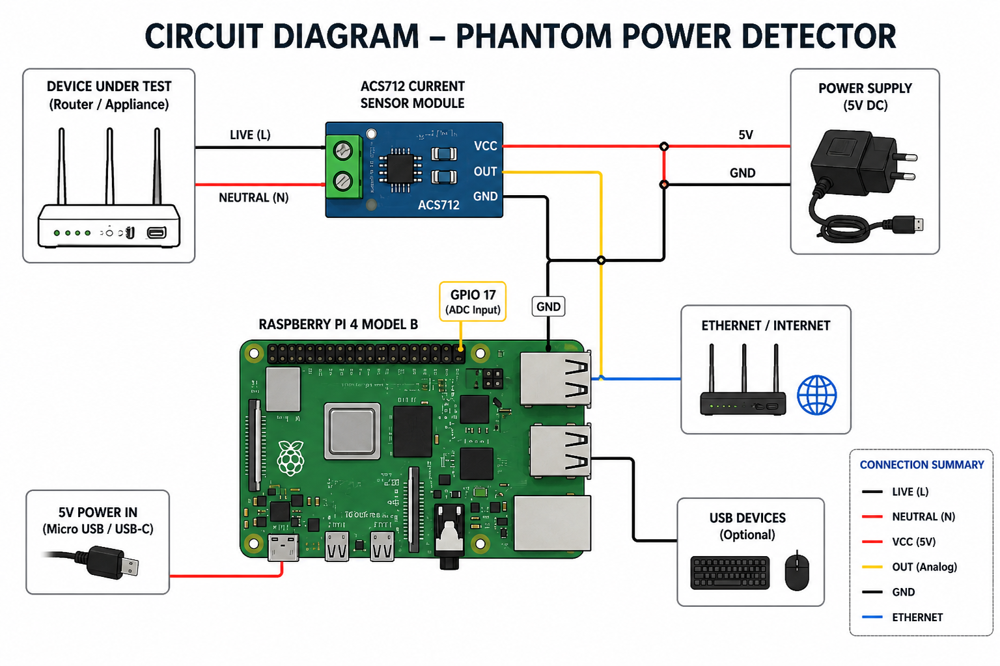
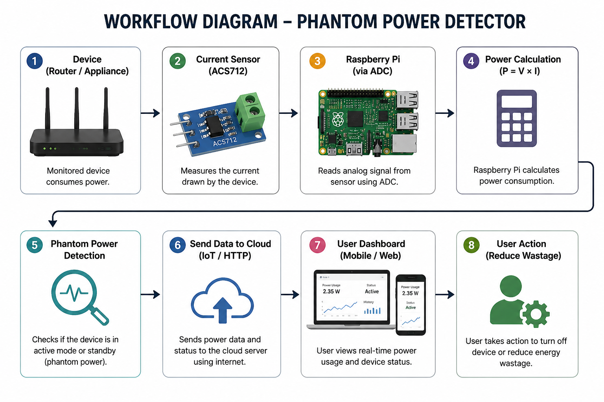

# ⚡ Phantom Power Detection System

An IoT-based project using Raspberry Pi to detect phantom (standby) power consumption and calculate energy usage and cost in real time.

---

## Problem Statement

Many electrical devices continue to consume power even when switched OFF. This is known as **phantom power**, which leads to energy wastage and increased electricity bills.

---

## Objective

To design a system that:

* Detects phantom power usage
* Calculates energy consumption
* Estimates electricity cost

---

## Components Used

* Raspberry Pi
* GPIO Switch / Sensor
* Power Supply

---

## Working Principle

1. The GPIO sensor detects whether a device is active or idle.
2. If the sensor is ON → phantom power is assumed.
3. Power consumption is taken as a fixed value (5W).
4. Energy is calculated using:

   * Energy (kWh) = Power × Time
5. Cost is calculated using tariff.

---
## 🔌 Circuit Diagram

---

## 🔄 Workflow Diagram

##  Output

The system continuously displays:

* Device Status (PHANTOM / OFF)
* Power (Watts)
* Energy (kWh)
* Cost (Rs)

---

## Applications

* Homes (reduce electricity bills)
* Offices (monitor standby devices)
* Energy-saving systems

---

## Future Scope

* Mobile app integration
* IoT cloud monitoring
* Automatic power cut-off system

